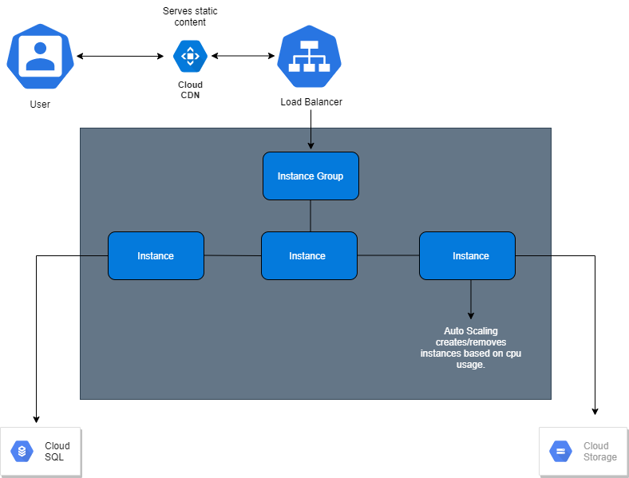

# **Cloud-1**
A simple wordpress website installed on the Google Cloud Platform (GCP). \
**The website will be hosted at `http://34.117.244.69/`**

## **Project Rules:**
* Your website must be running at all times on at least 2 servers, if possible located in different server farms.

* Some sort of mechanism will randomly and evenly redirect visitors to any of your
  servers.
    
* Traffic pikes will trigger the launch of other servers with perfectly synced data
  (and the other way around if the traffic fades)
  
* Logged-in users will stay identified for the length of a normal session, no matter
  what
  
* Static content should be distributed as good as you can (CDN)
  
* New content on the site should be available across all instances immediately (or
  at least within a few seconds)
  
* Any failure should be handled so that your website is always available
  
* Hosting cost should reflect your actual usage
  
* The public should not even be able to reach anything they have no reason to reach.

## **Setup Process:**
After you've logged-in to GCP:
1) ##### **Navigate to Marketplace and deploy the official Wordpress virtual machine solution.**
    * Navigate to storage and create a storage bucket.
    * Go to your **IAM & Admin** tab and select **Service Accounts**.
    * Create a service account and download the JSON keyfile.
    * Access the Wordpress VM via SSH. A basic terminal should open up.
    * Set super user editing privileges by entering `sudo su`.
    * Upload the JSON keyfile via the terminal.
    * Rename it to `keyFile.json` and move it to `/etc`
    * Navigate to `cd /var/www/html` and add the following to the `wp-config.php` file.
     `define( 'AS3CF_SETTINGS', serialize( array('provider' =>
      'gcp', 'key-file-path' => '/etc/keyFile.json',) ) );`
    * Navigate to Deployment Manager on GCP, open the Wordpress admin page and login using the password provided.
        * Go to plugins, install and activate the `WP Offload Media Lite` plugin.
        * In the WP Offload Media Lite plugin settings enter the name of the storage bucket you created.
    * While on the admin page, install and activate another plugin called `W3 Total Cache`.
      * In the settings navigate to the CDN tab:
        * Enable `CDN`
        * Select `Generic Mirror` as CDN type and save.
    * Navigate to the `external-ip/phpmyadmin` and login using the details from deployment manager.
    * Create a new user and only set the `username`, `password` and `check all privileges`.
    * Navigate to SQL, create a new MySQL instance and enable a private IP.
    * Under the Users tab add a new user with the details from the new user you just created on phpmyadmin.
    * Under the database tab create a new database, set charset to `utf8mb4` and collate to `utfmb48_general_ci`.
    * SSH into the Wordpress VM and edit the following lines in `wp-config.php`: \
      `define( 'DB_NAME', '<Your database name>');` \
      `define( 'DB_USER', '<Username you just created in phpmyadmin>');` \
      `define( 'DB_PASSWORD', '<Password of that user>');` \
      `define( 'DB_HOST', '<Private IP of your SQL instance>');` \
      `define( 'DB_CHARSET', 'utf8mb4');` \
      `define( 'DB_COLLATE', 'utfmb48_general_ci');`

2) ##### **Create an Image of your WordPress VM:**
    * Stop the WordPress VM you created in the previous step.
    * Navigate to the images section on GCP.
    * Select create image.
    * Select the source disk as the wordpress vm created previously.
    * Then click create.
    
3) ##### **Create an Instance Template from your image:**
    * Navigate to the instance template section on GCP.
    * Select `create instance template`.
    * Select `change` on the boot disk.
    * Select `Custom images` and choose the image that was created previously.
    * Under Firewall options, allow both `HTTP` and `HTTPS` traffic.
    * Then create.
    
4) ##### **Create a Health Check:**
   * Navigate to `Health check` (from search bar).
   * Select `create a health check`.
   * Name it, make sure the protocol is set to `TCP` and that the port number is `80`.
   * Then click create.
    
5) ##### **Create an Instance Group from your instance template:**
    * Navigate to the instance group section on GCP.
    * Select `create instance group`.
    * Under Location, choose `Multiple zones`.
    * Under Instance template, select the template that was previously created.
    * Under Autoscaling, select `Autoscale` - this will allow automatic resizing of this instance group for periods fo high and low load.
    * Set the `Minimum number of instances` to 2 and the `Maximum number of instances` to 6.
    * Under Autohealing, select the Health check previously created.
    * Then click create.
    
6) ##### **Create a Firewall Rule for external access:**
    * Navigate to VPC Network from your dashboard and select firewall.
    * Select `create firewall rule`.
    * Under Direction of traffic, select `Ingress`.
    * Under Action on match, select `Allow` and set the targets to `All instances in the network`.
    * Enter the source IP ranges from `130.211.0.0./22` to `35.191.0.0/16`.
    * Under Protocols and ports, select `TCP` and enter port `80`.
    
7) ##### **Reserve a Static External-IP:**
    * Navigate to `External IP addresses` and select `Reserve a static address`.
    * You should name it `loadbalancer-static`, however any name will do.
    * Under Type, select `Global` - for Global forwarding rules.
    * Then click reserve.
    
8) ##### **Create an HTTP(S) Load balancer:**
    * Navigate to Load balancing (from search bar - it's easiest this way).
    * Select `Create a load balancer` and start configuration of `HTTP(S) Load Balancing`.
    * Select `From Internet to my VMs` when prompted.
    * Under Backend configuration, `create a backend service`:
        * Under New backend, select the instance group previously created.
        * Enable `Cloud CDN` and select `Cache static content`.
        * Under Health check, select the health check previously created.
        * Then click create.
    * Under Frontend configuration, `create a frontend service`:
        * Under IP address, select the static ip previously reserved.
    * Then click create.
    
**That's it! Now you can access the website via the IP of the load balancer.**

# **Schema**

